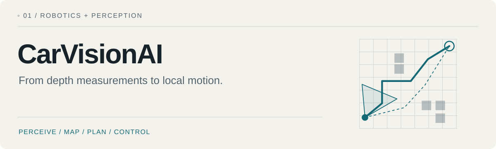
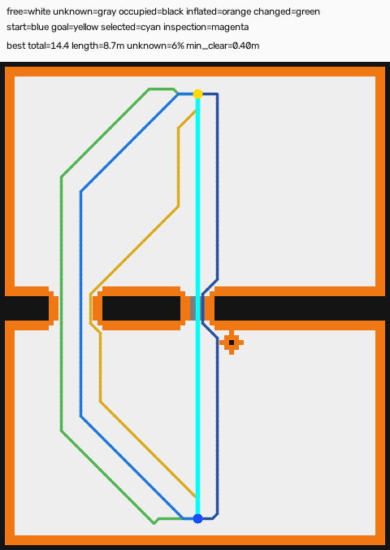
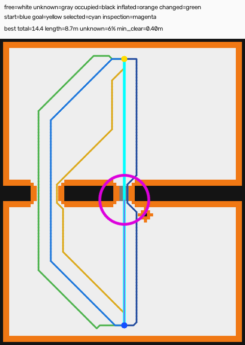
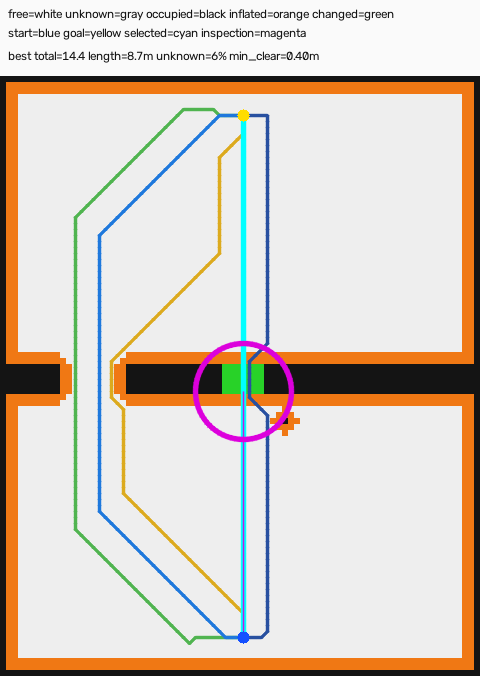
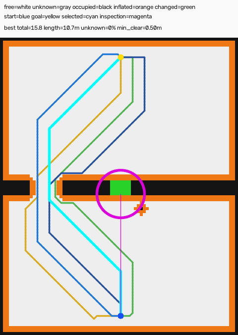
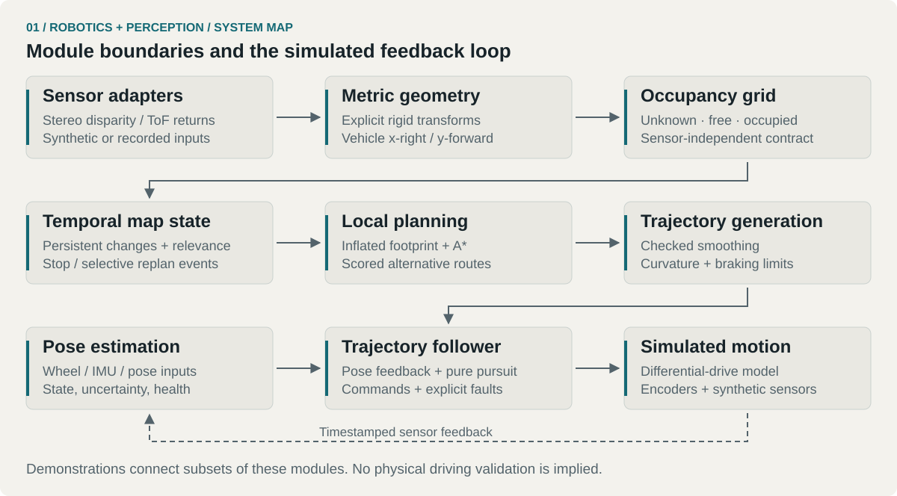

<picture>
  <source media="(prefers-color-scheme: dark)" srcset="docs/assets/portfolio/hero-dark.svg">
  
</picture>
[Colin's portfolio](https://github.com/loopedlol) · [System](#system) · [See it run](#demo) · [Quick start](#start) · [Technical guide](docs/TECHNICAL_GUIDE.md)

An autonomy development toolkit for a small differential-drive robot: **perception → mapping → planning → simulated control**. The modules also cover timestamped pose estimation, recorded sensor analysis, and optional 3D visualization.

<kbd>Python</kbd> <kbd>NumPy</kbd> <kbd>OpenCV</kbd> <kbd>Simulation + recorded-data tools</kbd>

The engineering question is how to connect useful local motion to uncertain sensor observations without making every layer depend on a particular sensor. Synthetic scenes make those boundaries inspectable before a physical rig is involved.

> **Scope:** development and simulation, with recorded-data adapters. The repository does not establish reliable physical autonomous driving or a safety-certified control system.

<a id="demo"></a>
## 01 / Inspect, refine, replan

The active-perception example starts with a rough map, proposes routes, selects an uncertain region to inspect, and replans after a simulated observation.

<table>
  <tr>
    <td width="50%"><br><b>01 — Candidate routes</b><br>Several paths through the same rough map.</td>
    <td width="50%"><br><b>02 — Directed inspection</b><br>One region chosen from route uncertainty.</td>
  </tr>
  <tr>
    <td><br><b>03 — Refined observations</b><br>A bounded mock observation changes the map.</td>
    <td><br><b>04 — Replanning</b><br>The selected route changes with the evidence.</td>
  </tr>
</table>

These are outputs from the repository's unchanged [demo script](scripts/run_active_perception_demo.py), using a **synthetic scene**. The circular refinement area is a mock observation, not a physical stereo-camera frustum. [Capture provenance](docs/VISUALS.md).

<a id="system"></a>
## 02 / From measurements to commands

<picture>
  <source media="(prefers-color-scheme: dark)" srcset="docs/assets/portfolio/system-dark.svg">
  
</picture>

The map describes module boundaries; individual demos connect different subsets.

| Boundary | What crosses it | Why it matters |
| --- | --- | --- |
| Sensor → geometry | Disparity, calibrated rays, explicit rigid transforms | Optical coordinates are converted before mapping. |
| Geometry → occupancy | Vehicle-frame metric points and sensor origin | The mapper remains independent of stereo and ToF. |
| Map → planning | Unknown / free / occupied cells | Unknown-space policy and footprint inflation are explicit. |
| Path → trajectory | Selected path, clearance, and vehicle limits | Smoothing is collision-checked; unsafe rounding falls back. |
| Trajectory → control | Command ID, map revision, estimated pose | Stale commands, invalidation, and controller faults have explicit behavior. |
| Autonomy → viewer | Versioned snapshots through a bounded queue | Optional visualization stays outside the control path. |

The details live in [stereo geometry](src/carvision/stereo.py), [mapping](src/carvision/mapping.py), [planning](src/carvision/planning.py), [trajectory generation](src/carvision/trajectory.py), [control](src/carvision/control.py), and [pose estimation](src/carvision/pose_estimation.py).

<a id="start"></a>
## 03 / Run a first experiment

From the repository root, with Python 3.10 or newer:

```bash
python3 -m venv .venv
source .venv/bin/activate
python -m pip install -e '.[dev]'
PYTHONPATH=src python scripts/run_active_perception_demo.py --output-dir outputs/planning_demo
```

On Windows, activate with `.venv\Scripts\activate`; set `PYTHONPATH=src` using your shell's environment-variable syntax.

Open the four numbered PNGs under `outputs/planning_demo/`. The generated `report.json` records the planner settings, inspection reasons, changed-cell count, and candidate scores.

Other entry points:

```bash
PYTHONPATH=src python scripts/run_mock_pipeline.py --sensor both --output-dir outputs/combined
PYTHONPATH=src python scripts/run_closed_loop_simulation.py --output-dir outputs/closed_loop
PYTHONPATH=src python scripts/run_pose_fusion_demo.py --output-dir outputs/pose_fusion
python -m pytest
```

The [technical guide](docs/TECHNICAL_GUIDE.md) preserves the full workflows for calibration, recorded stereo evaluation, event-driven replanning, trajectories, sensor-log replay and tuning, and the optional Open3D viewer. The viewer extra in `pyproject.toml` is restricted to Python below 3.13; use a compatible separate environment.

## 04 / Coordinate contracts

Distances are in **metres** and angles in **radians**.

- Optical camera: `x` right, `y` down, `z` forward.
- Vehicle: `x` right, `y` forward, `z` up.
- Planar heading: zero along `+y`, positive toward `+x`.
- Occupancy: `-1` unknown, `0` free, `100` occupied.

Mounting transforms include both rotation and translation. Depth is optical-axis depth, not slant range. [Full frame conventions](docs/TECHNICAL_GUIDE.md#coordinate-frames-and-units).

## 05 / What the evidence supports

The repository provides inspectable algorithms, deterministic synthetic demonstrations, tests, and recorded-data interfaces. It does **not** include a portfolio-ready physical-driving result or a real sensor dataset establishing end-to-end vehicle performance.

The current motion/slip models are simplified. Wheel odometry cannot independently detect unobserved slip. Delayed pose corrections are handled conservatively at the current state rather than by full history replay. Synthetic external pose corrections do not establish the accuracy of future hardware.

The next useful evidence would be a calibrated real stereo sequence, separately collected encoder/IMU logs, and measured behavior on the intended robot. See the [recorded sensor dataset contract](examples/recorded_sensor_dataset/README.md).
---

[← Portfolio](https://github.com/loopedlol) · [Related: temporal vision](https://github.com/loopedlol/SignLanguageAI) · [Visual assets](docs/VISUALS.md)

<sub>Colin / loopedlol · Field Notes · 2026</sub>
